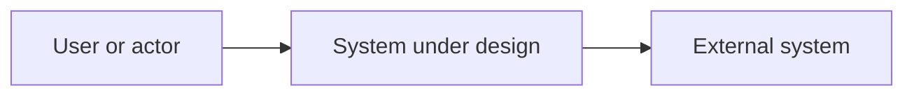
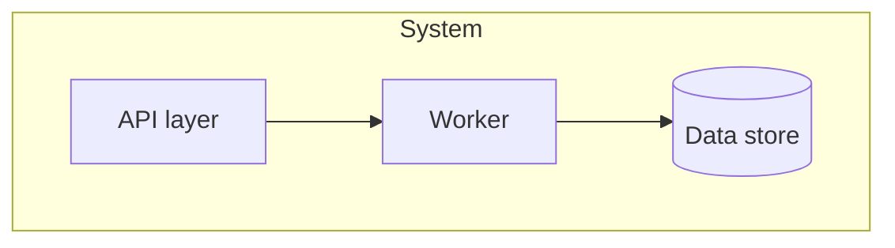
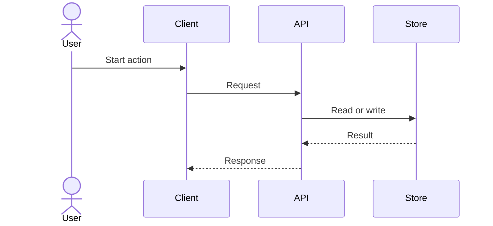
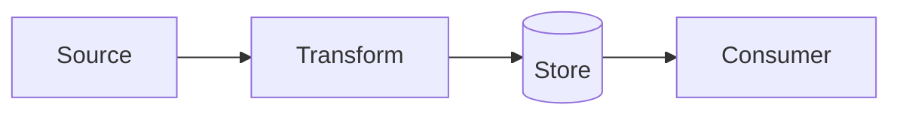
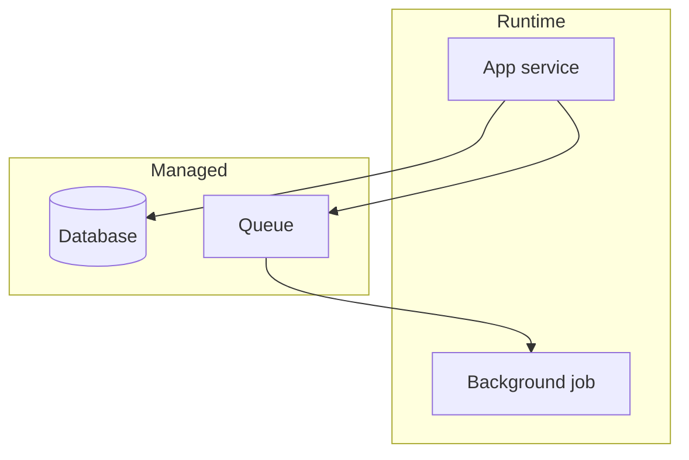
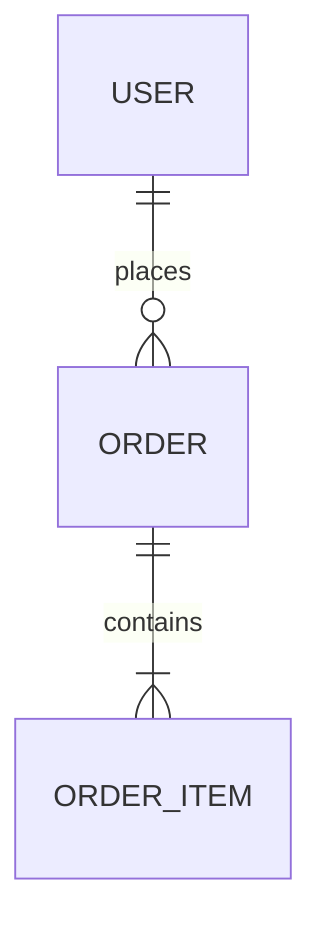
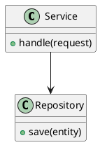
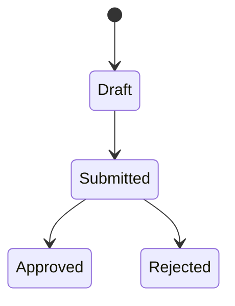

# Architecture Diagram Patterns

Use these patterns as starting points, not as filler. Replace every label and edge with source-grounded project facts.

## C4-Style Context



Use for scope, actors, and external dependencies. Do not include internal modules.

## Component Or Container



Use for internal responsibilities and dependencies. Keep deployment nodes out unless they are the point of the diagram.

PlantUML is a better fit when the component view needs UML package notation:

```plantuml
@startuml
package "System" {
  [API layer] --> [Worker]
  [Worker] --> database "Data store" as Store
}
@enduml
```

## Sequence



Use for one scenario. Avoid branching into multiple unrelated flows.

## Data Flow



Use for pipelines, transformations, and ownership of derived data.

## Deployment



Use for runtime placement, managed services, networks, and operational dependencies.

## Data Model



Use ER diagrams for persisted entities and cardinality. Use class diagrams for code types and inheritance.

## Class Or UML Model



Use for code ownership, inheritance, interfaces, and type relationships. Do not use it to describe runtime deployment.

## State



Use for lifecycle states and allowed transitions. Keep guards and side effects short.
